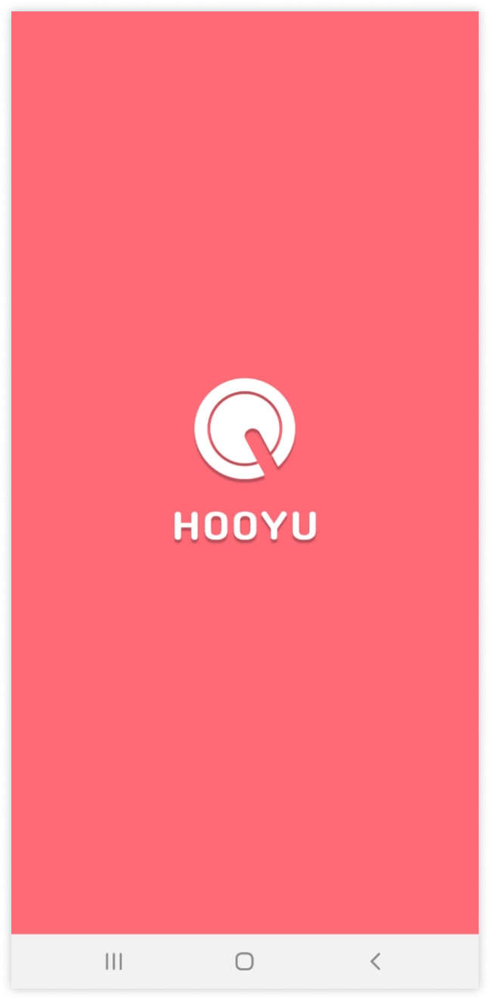
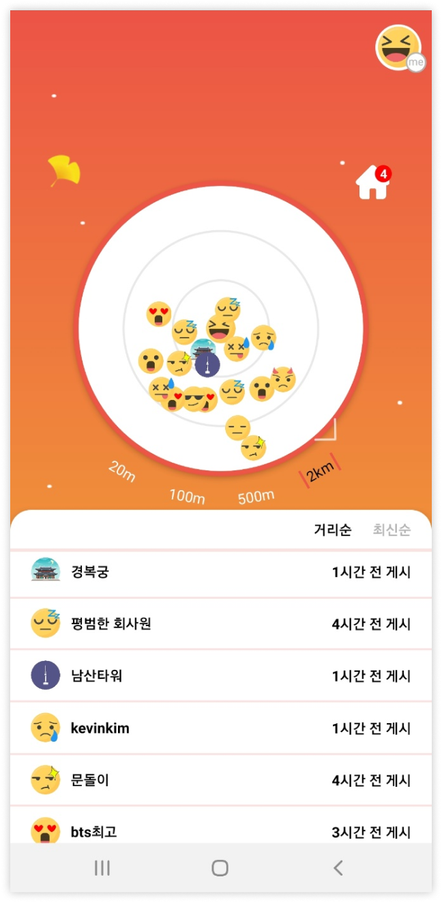
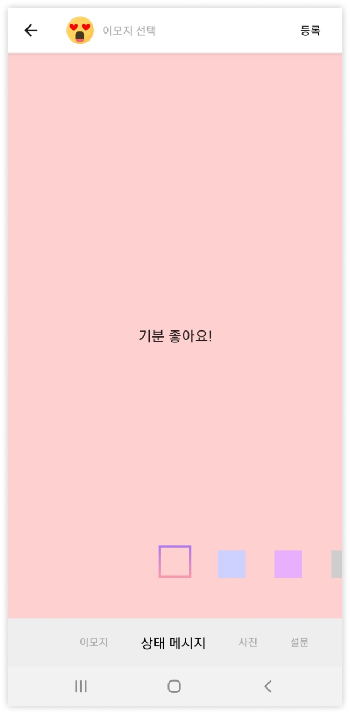
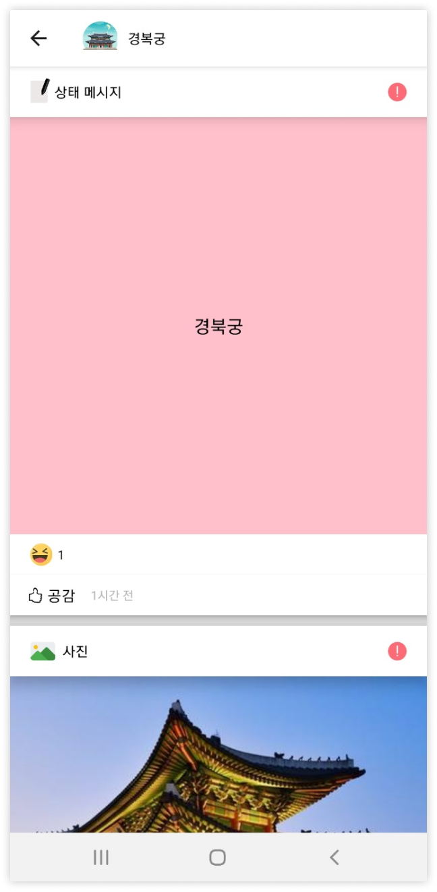
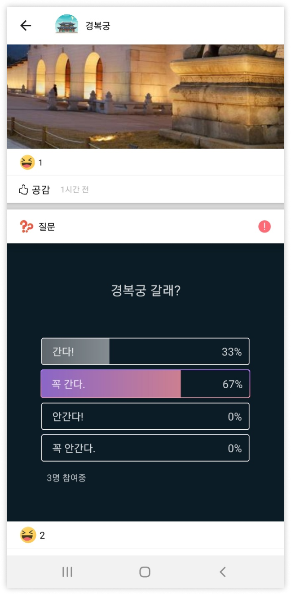
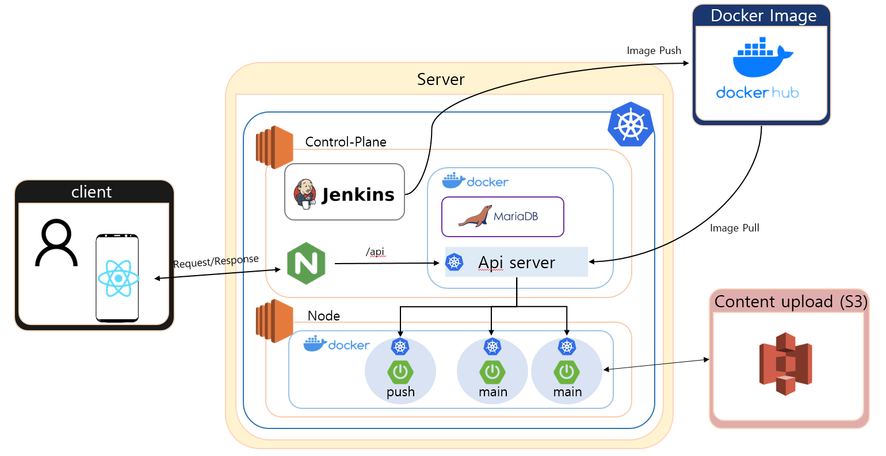
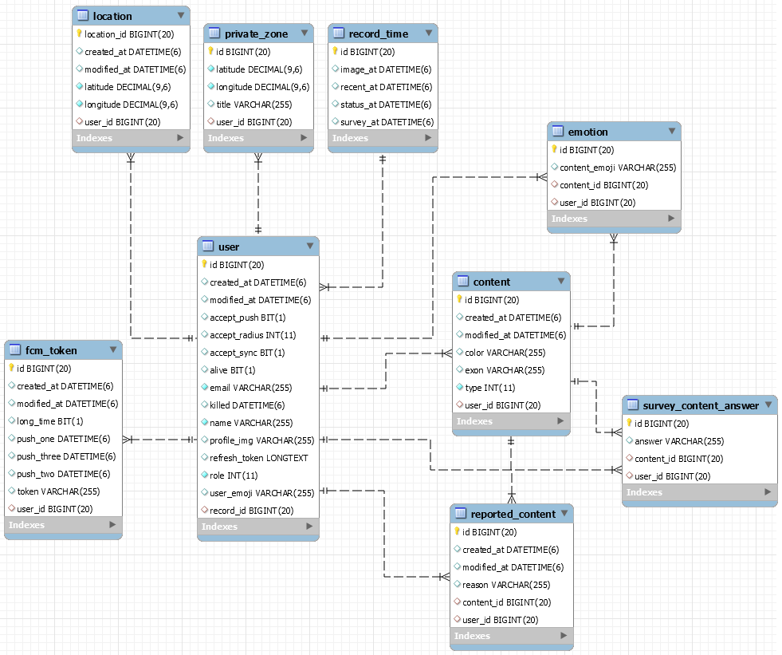

<div align="center">
  
  
  
  
  
  
  <br>
  
  
  
  
  
</div>

# 후유 : HOOYU


**내 주변에 있는 사람들은 어떤 사람들일까? 어떤 생각을 가지고 살까?**

> 위치적으로 주변 사람들의 상태 메시지 및 게시물을 확인할 수 있는 서비스
>
> 나를 보여주고 싶은 10~20대들! 나의 상태를 공유하는 서비스
>
> 당신의 상태 메시지, 사진, 질문을 공유해보세요.

[HOOYU APP Download Link](https://whoyou-bucket.s3.ap-northeast-2.amazonaws.com/hooyu.apk)

<br>

## 📋 Stack

1. 이슈관리 : Jira

2. 형상관리 : Gitlab

3. 커뮤니케이션 : Mattetmost, Notion, Webex

4. 개발 환경

   + OS : Windows 10

   + IDE
     + IntelliJ IDEA Ultimate 212.5457.46
     + Visual Studio Code 1.62.2

   + Database

     + mariadb image **[10.7.1](https://hub.docker.com/layers/mariadb/library/mariadb/10.7.1/images/sha256-f8a4b6793fc07a26246d511968e9f6633be0d4a2b3c8226b0f3a4d629fb77ef4?context=explore)**

     + MySQL Workbench 8.0.22

   + Server : AWS EC2 (MobaXterm)
     + Ubuntu 20.04.3 LTS

5. 상세 사용

   + Backend 
     + Java (Open-JDK Corretto 11.0.13) 
     + Spring Boot 2.5.2
     + `swagger2`, `actuator`, `firebase`, `spring-cloud-starter-aws:2.2.5.RELEASE`
   + Frontend
     + React Native 0.64.2
     + Node.js 16.13.0
     + `expo 43.0.0`, `redux 4.1.2`, `reduxjs/toolkit 1.6.2`
   + AWS
     + EC2
     + S3

     + nginx/1.18.0 (Ubuntu)

     + jenkins2.303.2
   
     + Docker 20.10.10
   
     + kubernetes 1.22.3

<br>

## 🚀 Getting Started

### Prerequisites

+ Android OS

  Available only on Android OS

- NPM

  ```
  npm install npm@latest -g
  ```

+ Android Studio

  https://developer.android.com/studio

+ React Native

  ```
  npm i -g create-react-native-app
  ```

### Installation

1. Clone the repo

   ```
   https://lab.ssafy.com/s05-final/S05P31A101.git
   ```

2. Move to react native directory and install NPM packages

   ```
   npm install
   ```

3. Run emulator in Android Studio

   + Open 'ADK Manager' in Android Studio
   + Create your virtual device and run it

4. Run app in virtual device

   ```
   npm run android
   ```

<br>

## 🌈 Usage
|Splash|Main|User List|
|:-:|:-:|:-:|
||||

|Content Create|Profile_1|Profile_2|
|:-:|:-:|:-:|
||||

<br>

## 🔨 Structure

### Architecture



### ERD



<br>

## 💬 Contact

[류현선](https://github.com/hs-ryu) - richman20486@gmail.com

[김승현](https://github.com/kevinkim-dev) - shkim2000@gmail.com

[나승호](https://github.com/qlfflwls5) - seungho.dev28@gmail.com

[박상욱](https://github.com/sangwook0613) - kvmoke@gmail.com

[최다윗](https://github.com/dawit95) - dawit0310@gmail.com
