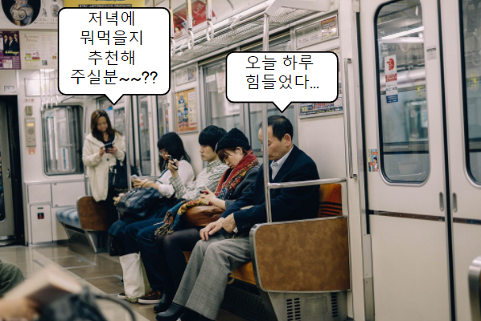
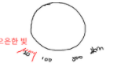
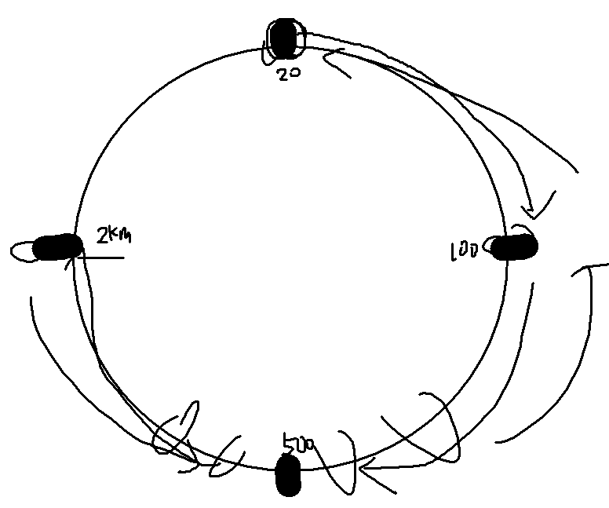
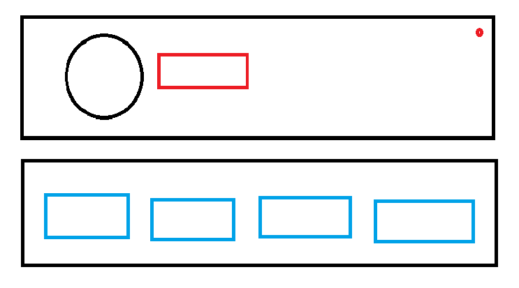

# 아이디어 회의

# 스테이터스

**서비스 한줄 요약 : (위치적으로) 주변 사람들의 상태창(정보)를 확인할 수 있는 서비스**

- 내 **(위치적으로)** 주변에 있는 사람들은 어떤 생각을 가지고 살까?
- 나를 보여주고 싶은 10~20대들! 나의 상태를 공유하는 서비스!

## 제공되는 기능

### 1. 위치 표시 기능

1. 원 표시

   앱의 메인 페이지에 정중앙에 보이는 UI로 사용자를 중심으로 주변 반경 내 위치한 유저들을 보여주는 기능

   1. 바운더리 표시

      - 4가지로 구성 20m, 100m, 500m, 2000m

      - 원의 바운더리를 변경하는 방식

        

        

   2. 사람들이 표시되는 방식

      - 내가 설정한 바운더리 안에 들어온다면, 그 사람의 현재 상태를 대변하는 이모지가 나타난다

      - 사람 선택 방식

        1. 한번만 클릭했을 때

           이모지의 테두리를 진하게 처리하고 해당 유저를 리스트에서 테두리 진하게 처리

        2. 두번 클릭했을 때

           해당 유저의 최근 게시물을 볼 수 있게 이동

            

2. 리스트 표시

   원에서 설정한 바운더리 안에 있는 모든 사람들을 리스트로 정리

   1. 보여주는 방식

      

      2개의 UI로 구성, 각 UI는 좌우로 스와이프 해서 이동할 수 있다

      모두 배치는 일렬로 처리, 닉네임이 너무 길면 ... 처리

      첫번째 UI (상단 그림)

      - 해당 유저의 최근 이모지와 닉네임 표시
      - 이곳을 터치하면, 해당 사람의 디테일 페이지로 이동
      - 새롭게 업데이트된 컨텐츠가 있다면 우상단에 빨간 점과 같은 표시 제공

      두번째 UI (하단 그림)

      - 갖고 있는 컴포넌트들은 다 표시 (없으면 표시 X)
      - 이때, 24시간 이내 업로드된 컴포넌트는 특별한 테두리 표시
      - 24시간 이내에 업로드된 컴포넌트를 터치하면 해당 컨텐츠를 볼 수 있게 이동

       

3. 프라이빗 존

   1. 설정 방식

      - 사용자가 직접 설정하는 방식으로 진행

        - 설정을 들어갈 수 있다.

          → 이를 까꿍 때 상태 메세지에서 이런 설정이 있다는 것을 인지시키기

        - 설정하는 방식은 당근마켓 같은 원리로 GPS 좌표를 잡아서 거기 기준 100m 반경

        - 설정할 수 있는 프라이빗 존의 수는 우선 1개

          - 여러 개를 설정할 것을 고려하여 DB 구성

   2. 구체적인 내용

      - 프라이빗 존의 반경은 디폴트는 반경 100m

      - 내가 프라이빗 존 안에 들어가있다고 파악되면, 다른 사용자들의 원에서 사라진다

      - 프라이빗 존 안에 내가 들어가면 남들은 나를 보는데 제한이 있지만, 나는 변한것이 없다.

      - 프라이빗 존 안에 있는 사람들을 다른 사람들(이하 A)에게 어떻게 보여질까?

        1. 프라이빗 존에 있는 사람들은 A에게 위치, 리스트, 반경 접근 푸시 알람이 아예 안뜬다.

        2. 단, A가 보고 싶은 반경이 500m 이상인 경우 2가지 예외를 둔다

           1. 원 옆에 '대피소(가제)' 라는 버튼이 생기고, 이곳에 A 반경 안에서 현재 프라이빗 존에 있는 사람들의 리스트가 나타나고 접근할 수 있다.
           2. A 반경 안에서 프라이빗 존에 있는 사람이 새로운 게시물을 생성했다면, 생성 푸시 알람을 받는다.

             

### 2. 푸시 기능

1. 푸시 반경 설정

   1. 20m, 100m, 500m, 2km
   2. (심화) 반경별로 푸쉬 혹은 원의 색깔 변화

    

2. 푸시 알림 설정

   1. 푸쉬 알림 켜기/끄기 - 끌 시 하단 모두 비활성화
   2. 푸쉬 알림 반경 크기와 메인페이지 반경 크기 동기화 켜기/끄기 - 끌 시 하단 모두 비활성
   3. 푸쉬 알림 범위 설정 - 슬라이더

    

3. 반경 접근 알림 푸시

   1. 자신이 설정한 반경 내에 앱 유저가 들어왔을 때 푸시 받음

      - 승호님이 나타나셨습니다 (?)

       

4. 컨텐츠 업로드 알림 푸시

   1. 자신이 설정한 반경 내의 앱 유저가 게시글을 작성하면 푸시 받음

      - 승호님의 스테이터스가 생성되었습니다 (?)

       

5. 까꿍 푸시

   1. 가입 이후 5분 ~ 10분 이후 푸시 예시를 서버에서 전송하면서 아하 포인트 제공
   2. 구글 연동 → 닉네임 설정 → 까꿍푸시 플로우로 가면 될듯

    

6. 장기간 미업로드 푸시

   1. 최근 스테이터스 업로드 이후 5일 이상 경과시 푸쉬로 간단히 알림, 수정을 유도
   2. 매일 지정된 시간에 DB 훑어서 진행

    

7. 푸쉬 UI/UX에 대한 고려 더 필요

  

### 3. 컨텐츠 기능

1. 기본적인 컨텐츠에 대한 설명

   1. 컨텐츠는 메인 페이지에서 생성할 수 있다.
   2. 컨텐츠 생성과 동시에 현재 이모지를 변경할 수 있다.
   3. 현재 컨텐츠의 종류는 상태, 이미지, 설문

    

2. 상태

   1. 상태 메시지 및 본인이 작성하고 싶은 프로필을 작성할 수 있다. (ex. 직업 : 싸피 교육생, 취미 : 기타)
   2. 현재 자신이 생각하는 감정을 바로 작성할 수도 있다. (ex. 오늘은 기분이 조금 우울하다..., 저랑 같이 술 한잔 하실 분 있나요?)
   3. 자신이 주위에 알려야 할 필요성이 있는 정보를 작성할 수도 있다. (위급상황 대처, 치매의 경우 주소 등)
   4. 기타 모든 자신이 원하는 것들을 텍스트로 작성 가능

    

3. 이미지

   1. 이미지 업로드 기능 (카메라 기능 x, 꾸미기 x, 단순 이미지 업로드)

    

4. 설문

   1. 간단한, 재미를 위한 설문 (ex. 오늘 저녁으로 뭘 먹을까요? 노래 추천해주세요.)
   2. 설문 생성 시에 뭘 올릴건지를 작성하고, 내 디테일 페이지에서 설문 삭제하면 종료
   3. 어느정도의 디자인을 우리가 제공. 꾸미는 기능은 아직은 x
   4. 일단 객관식. 주관식은 아직 미정
   5. 사람들이 불편해 할 요소를 방지 → 신고 기능

    

5. 컨텐츠 관리 (디테일 페이지)

   1. 위의 모든 컨텐츠들을 한 페이지에 담는 디테일 페이지
   2. 각 컨텐츠들의 히스토리(옛 게시물들)를 볼 수 있다.
   3. 내 디테일 페이지의 경우 컨텐츠들의 관리가 가능하다. (삭제만)
   4. 내 현재 이모지를 변경할 수 있다. (컨텐츠 없이 이모지만 변경하고 싶을 때)

     

### 4. 소셜 기능

1. 이모지 변경

   1. 컨텐츠 생성 시 / 디테일 페이지에서의 변경을 통해 변경할 수 있다.

    

2. 공감

   1. 다른 사람의 컨텐츠에 이모지를 통해서 공감을 남길 수 있다.

    

3. 댓글(미정)

   1. 다른 사람의 컨텐츠에 댓글을 남길 수 있다.

    

4. 신고

   1. 다른 사람의 컨텐츠가 비방용이라거나 문제를 일으킬만한 컨텐츠라고 생각될 경우 신고가 가능하다.

     

### 5. 채팅(미정)

